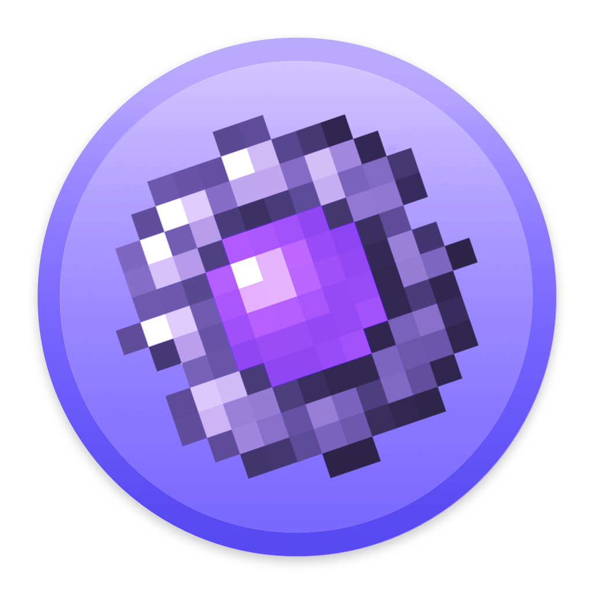

<p align="center"></p>

<h1 align="center">The End Network</h1>

<em><h5 align="center">(Server Modpack Launcher)</h5></em>

[<p align="center">](https://travis-ci.com/github/the-End-Network/the-End-Network-Launcher) [](https://github.com/the-End-Network/the-End-Network-Launcher/issues) [](https://play.theend.link) [](https://media3.giphy.com/media/35PYD9q6X5pcVhNZZd/200.gif)
  
 
  
<p align="center">Join our server without worrying about installing Java, Forge, or other mods. We'll handle that for you.</p>


## Downloads

You can download from [GitHub Releases](https://github.com/EndNetwork/Launcher)

#### Latest Release

[](https://github.com/EndNetwork/Launcher)

**Supported Platforms**

If you download from the [Releases](https://github.com/EndNetwork/Launcher) tab, select the installer for your system.

| Platform | File |
| -------- | ---- |
| Windows x64 | `endnetwork-WIN-v0.2.0.exe` |
| macOS | `endnetwork-MACOS-v0.2.0.dmg` |
| Linux x64 | `endnetwork-LINUX-v0.2.0.AppImage` |

## Console

To open the console, use the following keybind.

```console
ctrl + shift + i
```

Ensure that you have the console tab selected. Do not paste anything into the console unless you are 100% sure of what it will do. Pasting the wrong thing can expose sensitive information.

#### Export Output to a File

If you want to export the console output, simply right click anywhere on the console and click **Save as..**

## Development

### Getting Started

**System Requirements**

* [Node.js][nodejs] v12

---

**Clone and Install Dependencies**

```console
> git clone https://github.com/EndNetwork/Launcher.git
> cd Launcher
> npm install
```

---

**Launch Application**

```console
> npm start
```

---

**Build Installers**

To build for your current platform.

```console
> npm run dist
```

Build for a specific platform.

| Platform    | Command              |
| ----------- | -------------------- |
| Windows x64 | `npm run dist:win`   |
| macOS       | `npm run dist:mac`   |
| Linux x64   | `npm run dist:linux` |


[nodejs]: https://nodejs.org/en/ 'Node.js'
[vscode]: https://code.visualstudio.com/ 'Visual Studio Code'
[mainprocess]: https://electronjs.org/docs/tutorial/application-architecture#main-and-renderer-processes 'Main Process'
[rendererprocess]: https://electronjs.org/docs/tutorial/application-architecture#main-and-renderer-processes 'Renderer Process'
[chromedebugger]: https://marketplace.visualstudio.com/items?itemName=msjsdiag.debugger-for-chrome 'Debugger for Chrome'
[discord]: http://discord.theend.link 'Discord'
[wiki]: https://github.com/EndNetwork/Launcher/wiki 'wiki'
